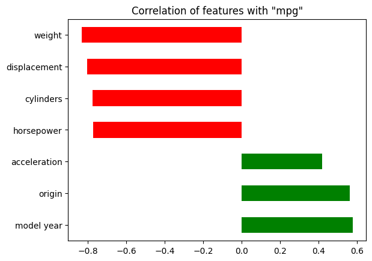

# Automotive Fuel Economy Prediction

## Project Overview
Understanding and predicting fuel efficiency is crucial, given rising fuel costs and growing environmental concerns. This report delves into the factors influencing automotive fuel consumption, focusing on a dataset of various car models. The analysis aims to estimate how far a car can travel on a single gallon of fuel, using key vehicle attributes such as weight, acceleration, cylinder count, etc. By leveraging machine learning techniques, the goal is to uncover patterns that influence fuel efficiency, ultimately providing insights that can assist manufacturers, consumers, and policymakers in making informed decisions.

The dataset used for this analysis includes various features that directly impact a vehicle’s mileage. Weight is a critical factor, as heavier cars typically require more power to drive. Similarly, the number of cylinders influences fuel consumption. Acceleration and horsepower also play crucial role, affecting fuel efficiency in different driving conditions. Through analysis, i have examined distributions, correlations, and patterns within the data to ensure meaningful insights and reliable predictions.

This report presents detailed findings from the exploratory analysis, highlighting relationships among vehicle attributes and fuel efficiency.

## Background and Overview: Analyzing Fuel Efficiency Trends in Automobiles
In an era of rising fuel costs and increasing environmental concerns, understanding fuel efficiency has become more crucial than ever. This project explores how various vehicle attributes—such as weight, acceleration, horsepower, and engine cylinder configuration—affect the miles a car can travel in per gallon of fuel. By leveraging these insights, this study sheds light on key automotive trends, enabling manufacturers and consumers to make more informed decisions about fuel efficiency, cost optimization, and sustainability.

The primary objectives of this analysis are:

1. To identify the major factors that affect the car's fuel efficiency.
2. To provide actionable insights to car manufactures for maximizing the fuel efficiency.
3. To develop a supervised model to predict vehicles mileage.

## About the dataset
- The auto_mpg.csv file contains information on features of different type of vehicles.
- Each records represents one car variant, and it's features like car brand, horsepower, displacement, number of cylinders, acceleration, model year, etc.

## Summary

The analysis of the dataset reveals several key insights into the factors influencing automotive fuel efficiency. The following points summarize the main findings:

[](https://github.com/pravin-nawghare/Automotive-Fuel-Economy-Predictior/blob/main/visuals/cylinders.png)
- 4-cylinder vehicles dominate the market, accounting for 51.3% of total market share. Their widespread popularity is largely due to their superior fuel efficiency, offering an average of 30 miles per gallon (MPG).
- Vehicles equipped with 6-cylinder and 8-cylinder engines focus primarily on performance, providing higher acceleration, power, and speed.
- Lastly, 3-cylinder vehicles exhibit fuel efficiency comparable to 6-cylinder models, yet they remain rare in the market. 

[](https://github.com/pravin-nawghare/Automotive-Fuel-Economy-Predictior/blob/main/visuals/Model%20year%20and%20mileage.png)

- The data shows that in the early 1970s to mid-1970s, cars achieved an average of 25 to 30 miles per gallon (MPG). However, from the late 1970s onward, mileage improved steadily, reaching 40 MPG by the early 
1980s—a remarkable increase compared to the previous decade.
- Vehicles from origin 1 consistently showed lower fuel efficiency than those from origin 2 and 3, suggesting differences in manufacturing strategies and technological advancements across regions. 

## Insights deep dive
### Engine Cylinders and Market Preferences
[](https://github.com/pravin-nawghare/Automotive-Fuel-Economy-Predictior/blob/main/visuals/market%20size%20by%20cylinders.png)

The data highlights the influence of engine cylinder configurations on both performance and market demand. Four-cylinder vehicles dominate, holding 51.3% of market share, largely due to their optimal balance between power and fuel efficiency, covering approximately 30 miles per gallon. Meanwhile, six-cylinder models strike a middle ground between performance and mileage, securing 47% of the market share. At the other end of the spectrum, eight-cylinder vehicles—despite their high power and acceleration—rank as the least fuel-efficient, averaging only 15 MPG, making them more appealing for performance-driven consumers rather than those focused on economy.

### Weight Reduction and Its Impact on Mileage
[](https://github.com/pravin-nawghare/Automotive-Fuel-Economy-Predictior/blob/main/visuals/weight%20vs%20mileage.png)

Another remarkable trend observed in this study is the 30% reduction in average vehicle weight over the last decade—from 3,400 kg to 2,400 kg—contributing significantly to improved fuel efficiency. As cars become lighter and more aerodynamically refined, fuel consumption decreases, allowing vehicles to cover greater distances with minimal energy expenditure. This shift in design strategy highlights the industry's commitment to enhancing affordability and sustainability.

### The Role of Car Origin and Brand Performance
[](https://github.com/pravin-nawghare/Automotive-Fuel-Economy-Predictior/blob/main/visuals/most%20sold%20car%20brands.png)

Automotive origin plays a key role in fuel efficiency trends. Cars from certain origins consistently exhibit better mileage compared to others, reinforcing differences in engineering philosophies and fuel economy optimizations across global manufacturers. Leading brands such as Ford and Chevrolet dominate the market, selling the highest number of vehicles, while Plymouth, AMC, Dodge, Toyota, and Volkswagen follow closely behind. Interestingly, while AMC vehicles individually do not claim the top sales position, their combined presence across three models makes AMC the most purchased brand in the market.

### The effect of car features on fuel efficiency of a car
[](https://github.com/pravin-nawghare/Automotive-Fuel-Economy-Predictior/blob/main/visuals/corelation_plot.png)

The plot shows what are the factors other than your driving skills affect the fuel efficiency of the car. Features like weight, displacement, cylinders and horsepower (red bars) are working to lower the fuel efficiency of cars as they increases. The negative correlation clearly visualize this and also discussed above too.

The bars in green namely acceleration, origin, model year are the features with positive correlation. Origin and model year have moderate positive correlation with mpg which means if these features increases fuel efficiency some what increases. On the other hand acceleration though have positive correlation but it is weak, so it's effect on mpg will be the lowest compared to other two.

Finally, we can draw a conclusion that a fuel efficient car will be built later in years and with newer variants in the market. Whereas, if features like weight, displacement, cylinders and horsepower have higher values then they will significantly lower the mileage of car.

## Engineered Features
From the data *weight group* feature is created from weight feature which segregates the car according to their weight groups.

**As a result of featured engineered, it has improved the Root Mean Squared Error from 2.49 to 2.41 and r2 score from 0.8821 to 0.89. Thus, significantly improving the models performance**
2.41 rmse and 0.889344 r2
2.4902 0.8821

## Model Selection
Random Forest, Ada Boost Regressor, Gradient Boosting Regressor, Linear Regression and Decision Tree Regressor were trained on the data and the results were compared based R2 score and RMSE metrics. From these models Random Forest, Ada Boost Regressor, Gradient Boosting Regressor were chosen to fine tune to improve the performance.
After hyper parameter tuning *Gradient Boosting Regressor* has better performance than other two.
|Model Name|RMSE|R2 Score|
|:-------:|:-----:|:------------|
|Ada Boost Regressor|3.088|0.818|
|Random Forest Regressor|2.968|0.832|
|Gradient Boosting Regressor|2.412|0.889|

## Model Explainability
|Metrics|Value|Explaination|
|:-------:|:-----:|:------------|
|R2 Score|0.89|It shows that our model can capture 89% of variation in the data.|
|RMSE|2.41|It indicates that the models prediction can less or more than actual value.|

## Conclusion

This study offers valuable insights into the factors driving fuel efficiency trends, ranging from model year advancements and engine configurations to market preferences and weight optimizations. As automotive technology continues to evolve, car manufacturers can utilize these findings to shape future fuel-efficient vehicle designs, optimize cost-effectiveness, and promote sustainable transportation solutions. Further analysis could explore predictive modeling to forecast upcoming efficiency trends, helping businesses anticipate consumer demands and engineering advancements in the next generation of automobiles.

### Usage

clone the repository

```
https://github.com/pravin-nawghare/Automotive-Fuel-Economy-Predictior.git
```

install the dependencies

```
pip install -r requirements.txt
```

Run the command

```
streamlit run app.py
```
This will start the streamlit app and you can view the dashboard in your browser.

### If you have any questions or suggestions, feel free to reach out to me at [Email](mailto:nawgharepraveen@gmail.com)
